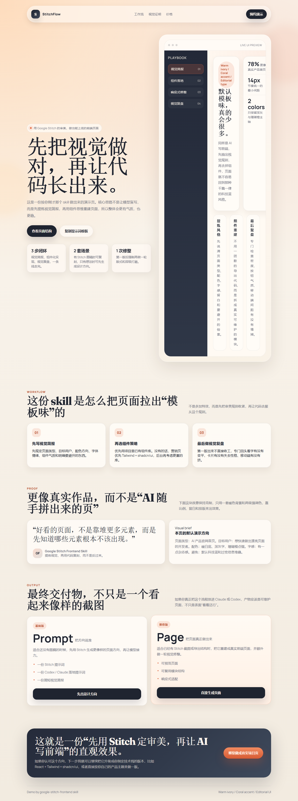
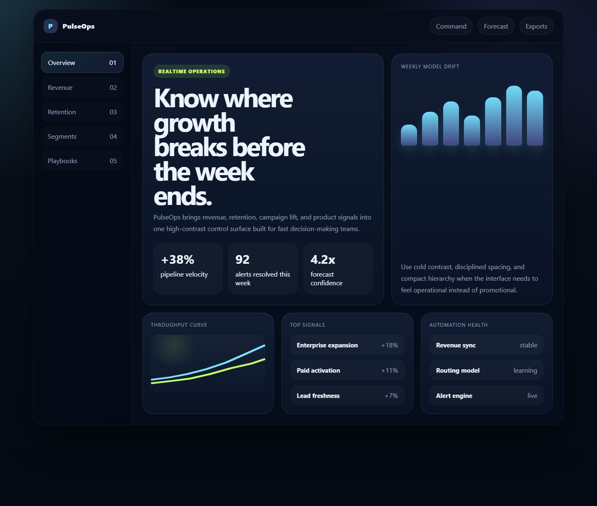
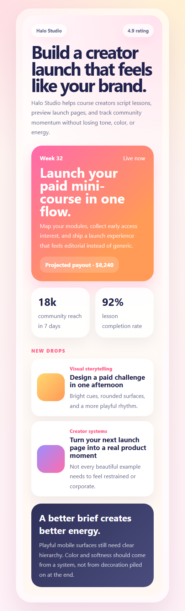
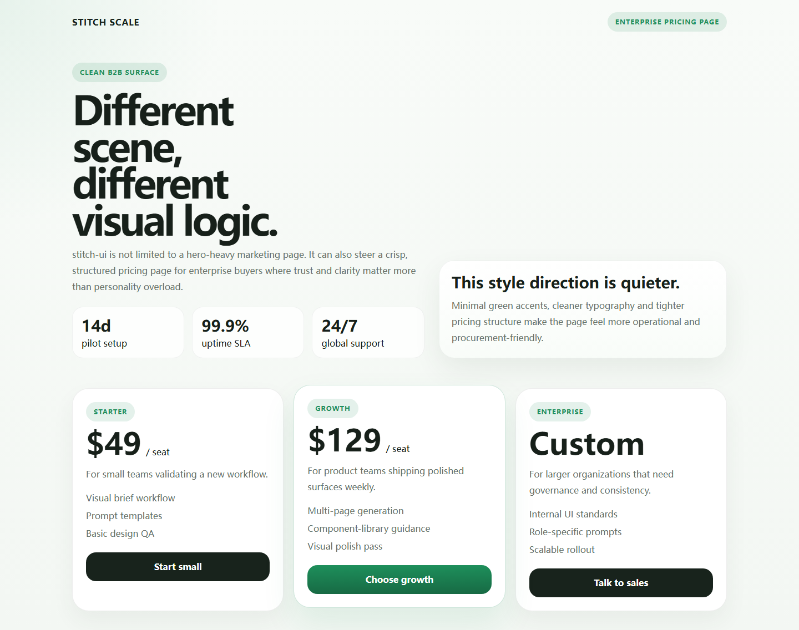
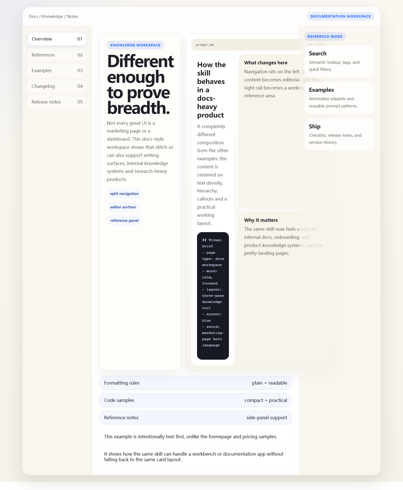

# stitch-ui

English | [简体中文](README.zh-CN.md)

[](https://github.com/wgd-12138/stitch-ui-skill/stargazers)
[](https://github.com/wgd-12138/stitch-ui-skill/blob/main/LICENSE)
[](https://github.com/wgd-12138/stitch-ui-skill/actions/workflows/validate.yml)
[](https://github.com/wgd-12138/stitch-ui-skill)

`stitch-ui` is a portable distribution of the `stitch-ui` skill for Claude and Codex.

It helps people turn Google Stitch ideas, screenshots, and exports into frontend pages that feel polished instead of generic.

## Why people star this

- it teaches a repeatable way to make AI-generated pages look better
- it covers multiple product surfaces instead of one homepage formula
- it includes prompt recipes, examples, installation, and packaging in one repo
- it works for both Claude and Codex from one source

## What this repository ships

| Package | Purpose | Path |
|---|---|---|
| Claude skill | Install directly into `~/.claude/skills/` | `plugins/stitch-ui/skills/stitch-ui` |
| Codex plugin | Install into a local Codex plugin library | `plugins/stitch-ui` |
| Repo marketplace entry | Lets Codex discover the plugin from this repo | `.agents/plugins/marketplace.json` |
| CLI installers | One-command install for PowerShell, Bash, and CMD | `install.ps1`, `install.sh`, `install.cmd` |

## Showcase by scene

The value of this skill is not one fixed aesthetic. It is the ability to keep very different aesthetics intentional.

### Stripe / Framer-inspired premium homepage

Best for product homepages and marketing sites.



### Linear-inspired dark analytics dashboard

Best for operations tools and high-signal control surfaces.



### Framer-inspired creator mobile app

Best for mobile-first consumer products and launch flows.



### Calm enterprise pricing page

Best for B2B decision pages where trust matters more than visual noise.



### Notion-inspired docs workspace

Best for documentation, research, and internal knowledge tools.



## Quick install

No Python command required.

### PowerShell

```powershell
.\install.ps1 all
```

### Bash

```bash
./install.sh all
```

### Windows CMD

```bat
install.cmd all
```

### Install only for Claude

```powershell
.\install.ps1 claude
```

### Install only for Codex

```powershell
.\install.ps1 codex
```

## Platform layout

| Platform | Install result |
|---|---|
| Claude | `~/.claude/skills/stitch-ui` |
| Codex | `~/plugins/stitch-ui` + `~/.agents/plugins/marketplace.json` |

## Why the packaging is split

Claude and Codex do not use the exact same distribution shape.

| Platform | Recommended format |
|---|---|
| Claude | Skill folder under `~/.claude/skills/` |
| Codex | Plugin folder plus marketplace entry |

This repository includes both forms so users can install from one source.

## Reference-inspired prompt recipes

If you want results closer to widely admired public product pages, study these recipe families:

- Stripe-style premium homepage
- Linear-style dark product surface
- Framer-style expressive builder page
- Notion-style knowledge workspace
- award-site experimental microsite

See:

- [plugins/stitch-ui/skills/stitch-ui/references/reference-inspired-prompts.md](plugins/stitch-ui/skills/stitch-ui/references/reference-inspired-prompts.md)

## What the skill teaches

The bundled skill teaches a repeatable frontend flow:

1. extract a compact visual brief
2. choose the component-library strategy
3. rebuild the page in reusable sections
4. run a visual polish pass before stopping

It also includes:

- prompt templates
- reference-inspired prompt recipes
- example-driven scene guidance

## Quality checks

This repo now includes:

- local validation script: `node scripts/validate.js`
- cross-platform install smoke tests in GitHub Actions
- plugin manifest and marketplace metadata

## Contributing

See:

- [CONTRIBUTING.md](CONTRIBUTING.md)
- [CHANGELOG.md](CHANGELOG.md)

## License

MIT
